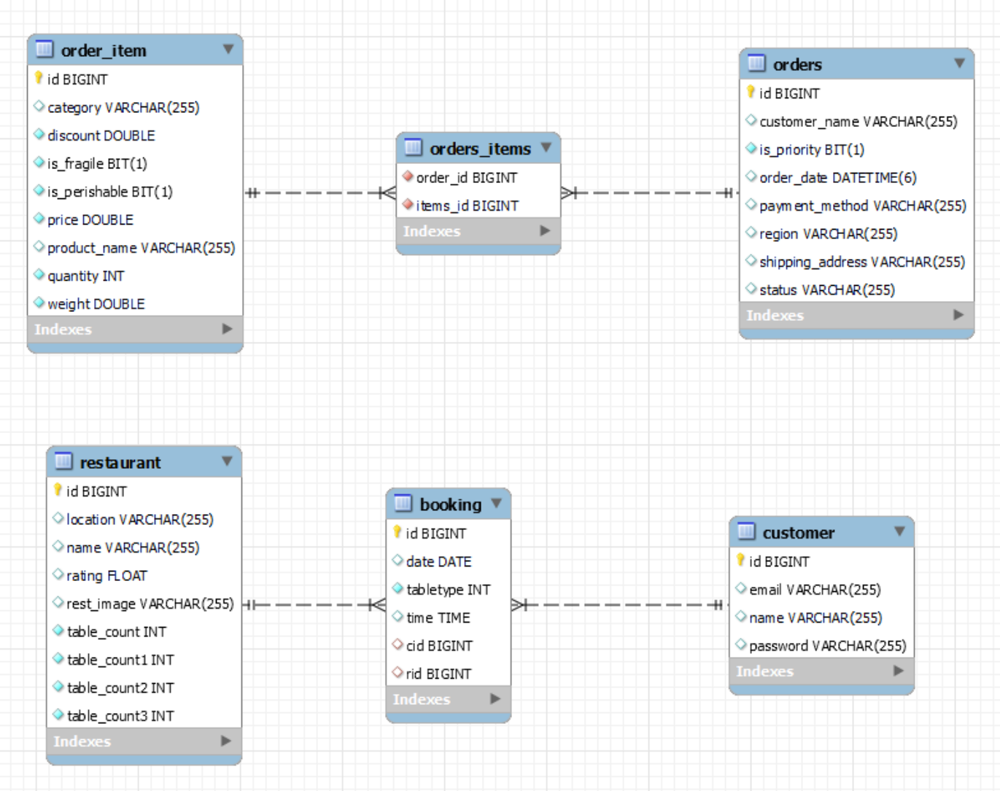
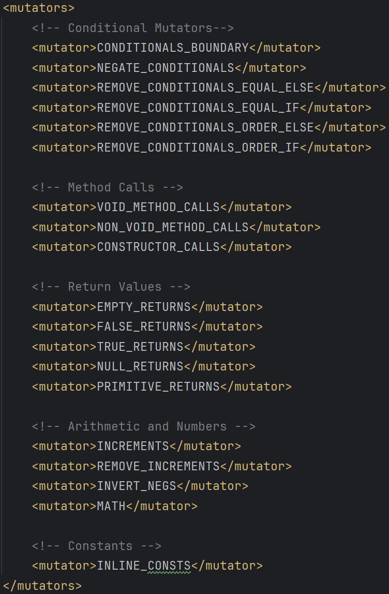
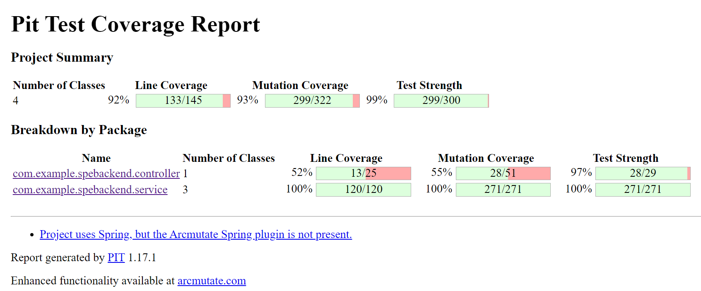
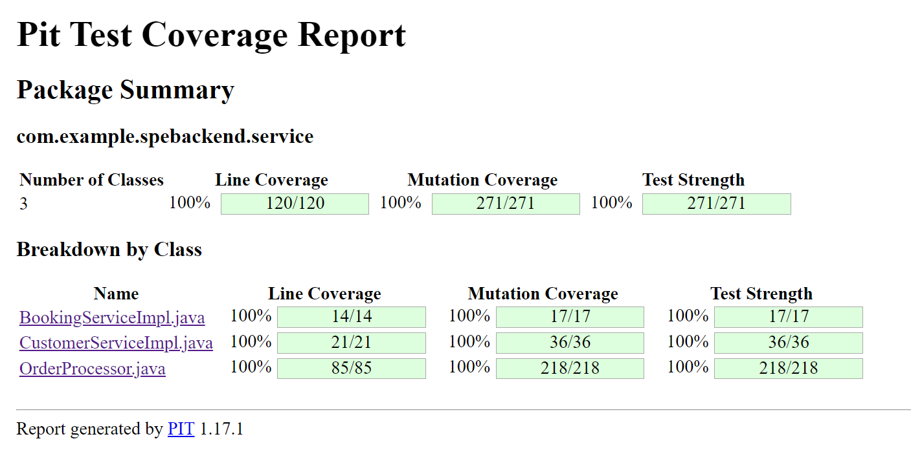
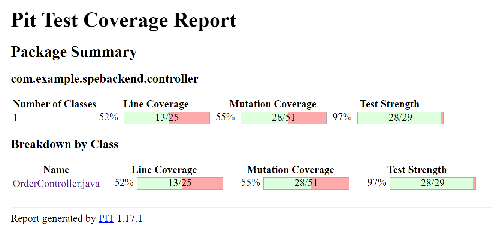

<H1> Booking System - A Software Testing Project</H1>

This Project deals with Mutation Testing on a Booking System, based on mutation
operators applied at the level of a statement within a method or a function
and at the integration level.

The entire code base of the project is available [here](https://github.com/vishwatejach/Mutation-Testing-Project).

<H5>Testing Tools:</H5>
JUnit 5 (implied by Spring Boot 3.2.5 starter) used for writing Unit and Integration Tests.  

Pitest Maven Plugin (version 1.17.1) for mutation testing

The Schema of the project goes as follows:

Types of Mutators Used:

<H3>The Results of the Mutation Testing are as follows:</H3>

Overall Test Report:

Unit Testing:

Integration Testing:

